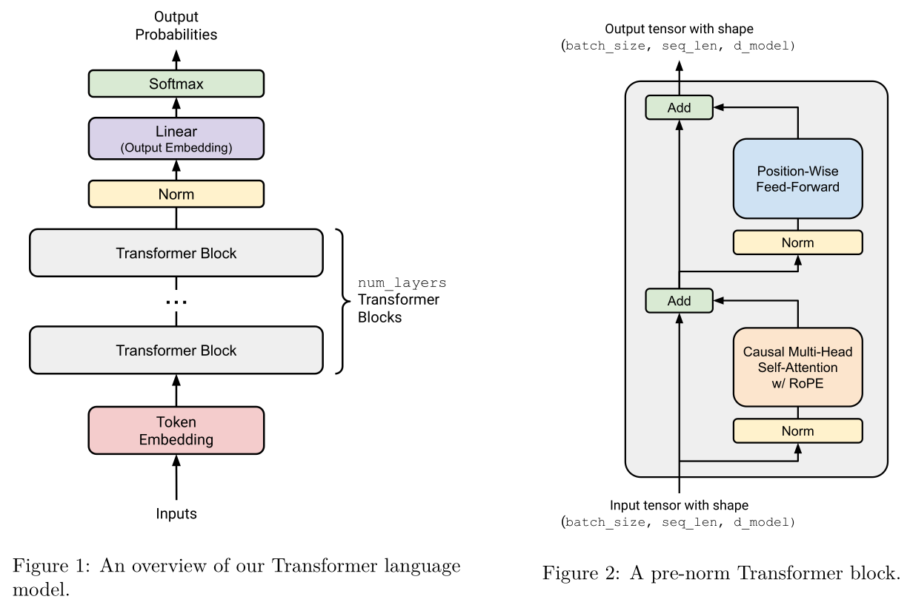

## Transformer Block

[[TOC]]



### RMS Norm

RMS Norm 是对标准 LayerNorm（归一化层） 的一种简化和优化。在 Transformer 中，归一化层的作用是一个“稳定器”，防止模型训练过程中的梯度爆炸或消失，从而加速收敛并提升性能。RMSNorm 的设计哲学是：去掉标准归一化中可能不那么必要的部分（均值中心化），只保留最核心的缩放（Scaling）部分，从而在保证效果的同时提升计算效率。

传统LayerNorm 的两步操作：
1. 中心化 Re-centering： 将输入向量减去其均值，使其均值为0
2. 缩放 Re-scaling: 将结果除以其标准差，使其方差为1

而 RMSNorm 的作者通过实验发现，“中心化”这一步对性能的贡献不大，但却消耗了计算资源。因此，他们大胆地将其移除，只保留了“缩放”这一步。但它不是用“标准差”来缩放，而是用一个更简单的统计量——均方根 (Root Mean Square, RMS)。

$$
\text{RMSNorm}(a_i) = \frac{a_i}{\text{RMS}(a)} \cdot g_i
$$

$$
\text{RMS}(a) = \sqrt{\frac{1}{d_{model}} \sum_{i=1}^{d_{model}} a_i^2 + \varepsilon}
$$

$g_i$ 是一个可学习的参数，而 $\varepsilon$ 是一个通常固定为 $1e-5$ 的超参数。


```python
# 核心公式
rms = torch.sqrt(torch.mean(x**2, dim=(-1), keepdim=True) + self.eps)
normalized_x = x / rms
```

假设输入 x 的 shape为 (batch_size, seq_len, d_model):
- `x**2`: 对输入的每个元素求平方
- `torch.mean(..., dim=(-1), keepdim=True)`: 沿着最后一个维度(d_model) 求均值。这意味着对 seq 中每一个token向量，都独立计算其所有特征(d_model个) 的平方均值
- `keepdim=True`: 确保计算结果的维度仍然是 (batch_size, seq_len, d_model) 而不是 (batch_size, seq_len), 保持这个 "1" 的维度是为了下一步的广播
- `torch.sqrt(...)`: 开方，得到RMS值
- `x/rms`: **广播机制**。 shape 为 `[batch_size, seq_len, d_model]` 的 `x` 会被 shape 为 `[batch_size, seq_len, 1]` 的 `rms` 相除。PyTorch 会自动将 `rms` 的值沿着最后一个维度复制 `d_model` 次，使得每个 token 向量中的所有元素都除以该 token 自身的 RMS 值。
- 最终，`normalize_x` 中的每一个 token 向量的RMS值都近似为1。

单纯的归一化操作虽然稳定了数据，但也带来一个问题：它强制性地抹去了不同 token 向量之间以及向量内部不同特征之间的“幅度信息”，这可能会限制模型的表达能力。模型需要学习放大或缩小某些重要的特征。

```python
self.W = nn.Parameter(torch.ones(d_model, device=device, dtype=dtype))
# ... in forward ...
normalized_x = (x / rms) * self.W
```

`self.W` 即上面公式中的 $g_i$, 是一个shape为 (d_model) 的向量，被 `nn.Parameter` 包装，意味着它的值是可学习的。

`self.W` 初始化为1 (`torch.ones(...)`)，意味着训练开始时， `* self.W ` 这个操作什么也不做。

在训练中，模型会通过反向传播学习 `self.W` 中的每一个值。如果模型发现第 `i` 个特征非常重要，它就会让 `self.W[i]` 的值变大；反之，则可能让其变小。


### Multi-head Self-Attention

[code](../cs336_basics/transformer.py)

该class的主要任务为：接收一个序列的token表示（a sequence of token representations），然后为序列中的每一个token，计算出一个新的、融合了上下文信息的表示。

#### `__init__` method

1. `assert d_model % num_heads == 0`
	- 确保模型的总维度 `d_model` 可以被头的数量 `num_heads` 整除。多头注意力的思想是把 `d_model` 的“工作空间”分割成 `num_heads` 个独立的、更小的“子空间”。每个子空间的维度就是 `d_k = d_model // num_heads`。如果不能整除，就无法平均分配。
2. `self.rope = RotaryPositionalEmbedding(...)`
	- 初始化RoPE模块。这是一个**非学习**的模块，它的作用是在前向传播时对Q和K向量进行“旋转”，以注入位置信息。
3. `self.q_proj`, `self.k_proj`, `self.v_proj`
	- 这三个是**独立**的线性层（`Linear`），是注意力机制的**核心参数**。它们是三个“制卡机器”。
	- `q_proj` (Query Projection): 负责将输入 `x` 转换成Query向量 `q`。它学习如何提取“查询意图”。
	- `k_proj` (Key Projection): 负责将输入 `x` 转换成Key向量 `k`。它学习如何提取“身份标签”。
	- `v_proj` (Value Projection): 负责将输入 `x` 转换成Value向量 `v`。它学习如何提取“核心内容”。
	- 它们的输入和输出维度都是 `d_model`。
4. `self.o_proj`
	- 输出投影 output projection 线性层。在多头注意力中，每个头都会独立计算出一个结果。我们会把所有头的结果拼接（concatenate）起来。但简单的拼接只是把信息堆在一起。`o_proj` 的作用就是对这些拼接起来的信息进行一次**线性变换**，学习如何将所有头的“见解”**融合、混合**成一个统一、连贯的最终输出。

#### `forward` 方法

1. 投影到 Q，K，V

```python
q = self.q_proj(x)
k = self.k_proj(x)
v = self.v_proj(x)
```

- **输入**: `x`， shape 为 `(batch, seq_len, d_model)`。
- **操作**: 将同一个输入 `x` 分别喂给三个不同的线性层。
- **输出**: `q`, `k`, `v`， shape 都还是 `(batch, seq_len, d_model)`。现在，每个词元都有了三个不同的身份表示。

2. 分割成多头

```python
q = einops.rearrange(q, 'b s (h d) -> b h s d', h=self.num_heads)
k = einops.rearrange(k, 'b s (h d) -> b h s d', h=self.num_heads)
v = einops.rearrange(v, 'b s (h d) -> b h s d', h=self.num_heads)
```

- **输入**: `q`, `k`, `v`， shape 为 `(batch, seq_len, d_model)`。
- **操作**: 使用 `einops` 进行维度重排。`'b s (h d) -> b h s d'` 的意思是：
	-   `b` 和 `s` 维度保持不变。
	-   将最后一个维度（`d_model`）拆分成 `h` (头的数量) 和 `d` (每个头的维度 `d_k`) 两部分。
	-   将 `h` 维度提到前面，形成一个新的维度。
- **输出**: `q`, `k`, `v`， shape 变为 `(batch, num_heads, seq_len, d_k)`。这可以理解为我们为每个样本创建了 `num_heads` 个并行的“注意力宇宙”，每个宇宙的处理维度是 `d_k`。

3. 根据需要应用RoPE


4. 创建 Causal mask


5. 缩放点积注意力 scaled dot product attention

```python
attention_output = scaled_dot_product_attention(q, k, v, mask=causal_mask)
```

- **输入**: 位置感知的 `q`, `k`，原始的 `v`，以及因果遮罩 `causal_mask`。
- **操作**: 这是注意力的核心计算，在一个独立的函数中完成。它会执行 `softmax((q @ k.T) / sqrt(d_k) + mask) @ v`。
    -   `q @ k.T` 计算注意力分数。
    -   `/ sqrt(d_k)` 进行缩放，防止梯度过小。
    -   `+ mask` 应用遮罩（在PyTorch的实现中，通常是将`False`的位置设置为`-inf`）。
    -   `softmax` 将分数转为权重。
    -   `@ v` 用权重对Value进行加权求和。
- **输出**: `attention_output`， shape 为 `(batch, num_heads, seq_len, d_k)`。这是每个头独立计算出的、融合了上下文信息的输出。

6. 拼接多头并进行最终投影

```python
output = einops.rearrange(attention_output, 'b h s d -> b s (h d)')

return self.o_proj(output)
```

- **输入**: `attention_output`， shape 为 `(batch, num_heads, seq_len, d_k)`。
- **操作1 (rearrange)**: 这是第2步的逆操作。它将 `num_heads` 和 `d_k` 两个维度重新**合并**成一个 `d_model` 维度。
- **中间输出**: `output`， shape 恢复为 `(batch, seq_len, d_model)`。
- **操作2 (o_proj)**: 将合并后的张量喂给输出投影层 `self.o_proj`。
- **最终输出**:  shape 仍为 `(batch, seq_len, d_model)`。这是经过所有头的信息融合、并由`o_proj`学习如何最佳组合后，得到的最终上下文表示。这个输出将作为下一个Transformer Block的输入。


### RoPE


### Positon-Wise Feed-Forward

在原始Transformer论文中，Transformer 块的 feed-forward network 用的是两个线性层 + 一个ReLU激活函数。

但是，现代大模型引入了门控机制 gating mechanism，使用的是 “SwiGLU” 激活函数。该激活函数合并了 SiLU(也叫Swish) 激活函数 和 GLU (Gated Linear Unit 线性门控单元)。

$$
\text{SiLU}(x) = x \cdot \sigma(x) = \frac{x}{1+e^{-x}}
$$

$\sigma$ 代表sigmoid函数

$$
\text{GLU}(x,W_1,W_2) = \sigma(W_1x) \otimes W_2(x)
$$

$\otimes$ 代表逐位相乘

将 SiLU 和 GLU 合并，便得到了SwiGLU —— 我们将用它来实现前馈网络FFN：

$$
\text{FFN}(x) = \text{SwiGLU}(x,W_1,W_2,W_3) = W_2(\text{SiLU}(W_1x) \otimes W_3x)
$$

在这里， $x \in \R^{d_{model}}, W1,W3 \in \R^{d_{ff} \times d_{model}}, W_2 \in \R^{d_{model} \times d_{ff}}$, 并且一般来说 $d_{ff} = \frac{8}{3}d_{model}$


### Add


